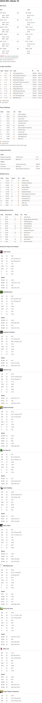

# Fantasy Football Reports

A cleaner, more maintainable fantasy football reporting tool for ESPN leagues.

## Requirements

- Python 3.9+

## Features

- Weekly reports with detailed statistics
- Box scores with analysis of bench scoring and "what could have been" scenarios
- League standings and power rankings
- Points per player per position analysis
- LLM-generated weekly summaries
- Clean HTML reports with consistent styling
- Easy to run from the command line

## Installation

1. Clone this repository
2. Install from Source with dependencies:
  ```bash
  # for a regular installation
  pip install .
  ```
  ```bash
  # or install in development mode
  pip install -e .
  ````
1. Create a `.env` file with [your ESPN API credentials](https://github.com/cwendt94/espn-api/discussions/150#discussioncomment-133615) (use `.env.example` as a template)

## Usage

### Generate a report for the current week

```bash
# Using the run script
./run.sh

# Or using the CLI
ff weekly --open
````

### Generate a report for a specific week

```bash
ff weekly --week 10 --open
```

### Generate reports for multiple weeks

```bash
ff generate-all --start 1 --end 17
```

### CLI Options

```
Usage: ff [OPTIONS] COMMAND [ARGS]...

  Fantasy Football CLI application for generating reports and statistics.

Options:
  --help  Show this message and exit.

Commands:
  generate-all  Generate reports for all weeks in a range.
  weekly        Generate a weekly fantasy football report.
```

Weekly command options:

```
--year, -y INTEGER    NFL season year to generate report for
--week, -w INTEGER    NFL week to generate report for (0 for current week)
--output, -o TEXT     Output file path (defaults to YEAR-weekWEEK.html)
```

## Building and Previewing

This project uses a `Makefile` to simplify common tasks.

### Preview a Report

To generate a report for a specific week and view it in your browser, use the `preview` command. A local web server will be started.

```bash
make preview WEEK=3
```

This is equivalent to running:

```bash
./build.sh --week 3
```

### Create a Build

To create a production-ready build in the `dist/` directory, use the `build` command. This will generate all reports and assets needed for deployment.

```bash
make build
```

This is equivalent to running:

```bash
./build.sh build
```

### Deployment

The `Makefile` also includes a `deploy` target to sync the `dist/` directory to a remote server using `rsync`. You will need to configure the destination in the `Makefile`.

```bash
make deploy
```

## Uninstall

```
pip uninstall fantasy-football-reports
```

The packages `setup.py` have to be removed individually.

## Project Structure

- `ff/` - Main package directory
  - `__main__.py` - CLI entry point
  - `config.py` - Configuration handling
  - `data.py` - ESPN API data retrieval
  - `llm_report.py` - LLM-based report generation
  - `reports.py` - Report generation
  - `stats.py` - Statistical calculations
  - `templates.py` - HTML template handling
- `templates/` - Jinja2 HTML templates
- `build.sh` - Unified script for building and previewing reports
- `Makefile` - Makefile for common development tasks
- `run.sh` - Convenience script for running the application

## Customization

You can customize the report by:

1. Editing the Jinja2 templates in the `templates/` directory
2. Adjusting the CSS styles in the base template
3. Adding new statistical calculations to `stats.py`
4. Creating new report types in `reports.py`

## Example

s in `reports.py`

## Example

